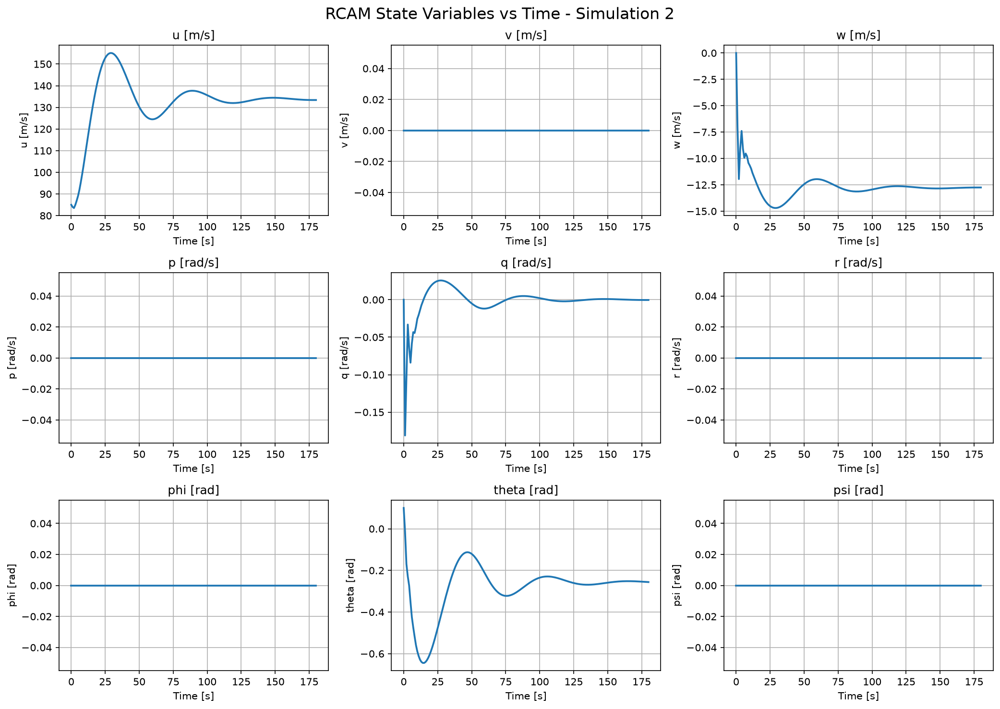
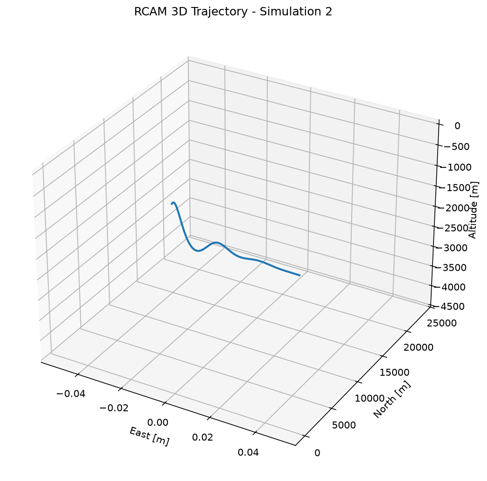
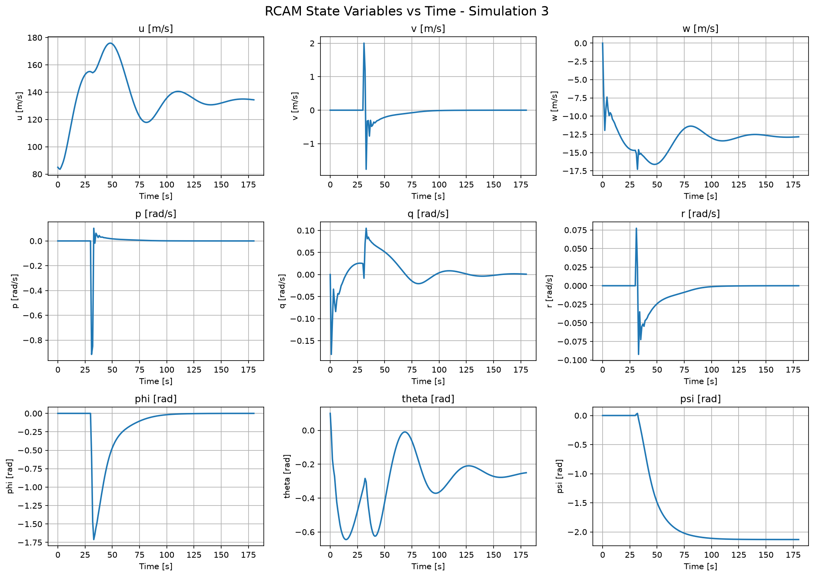
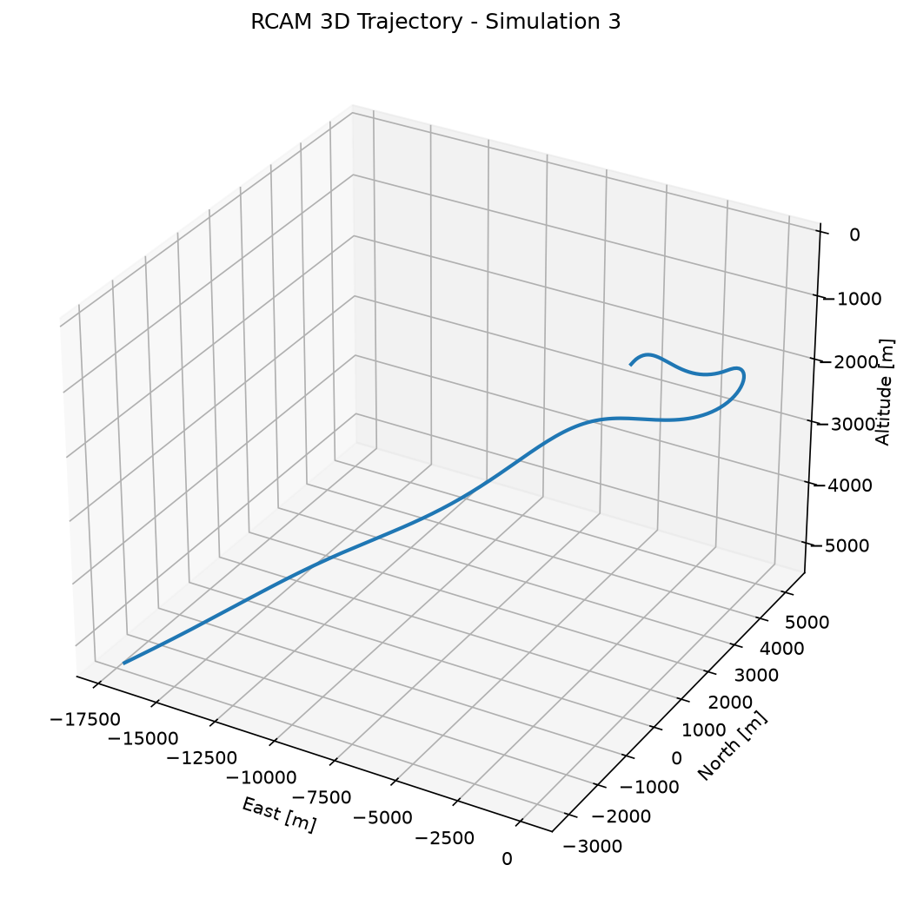
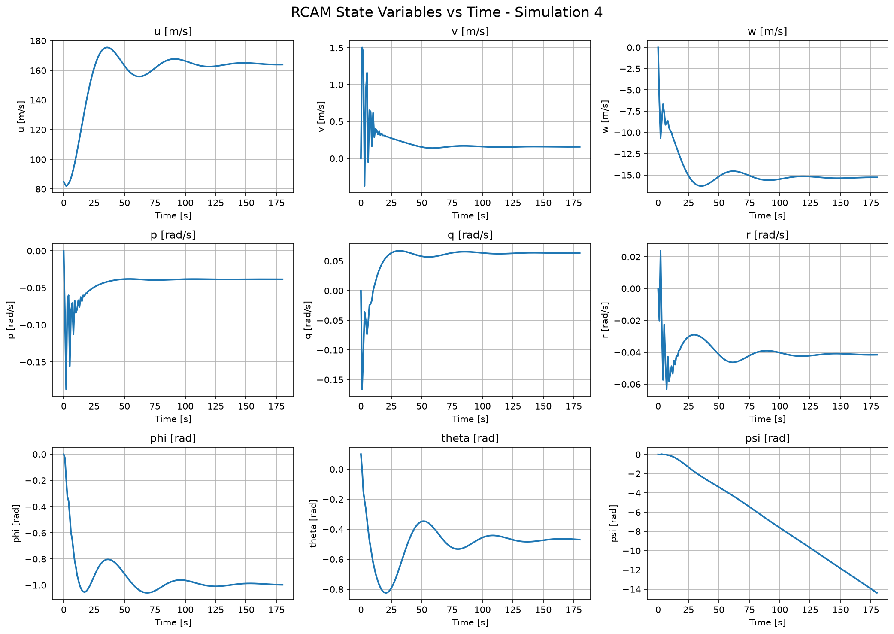
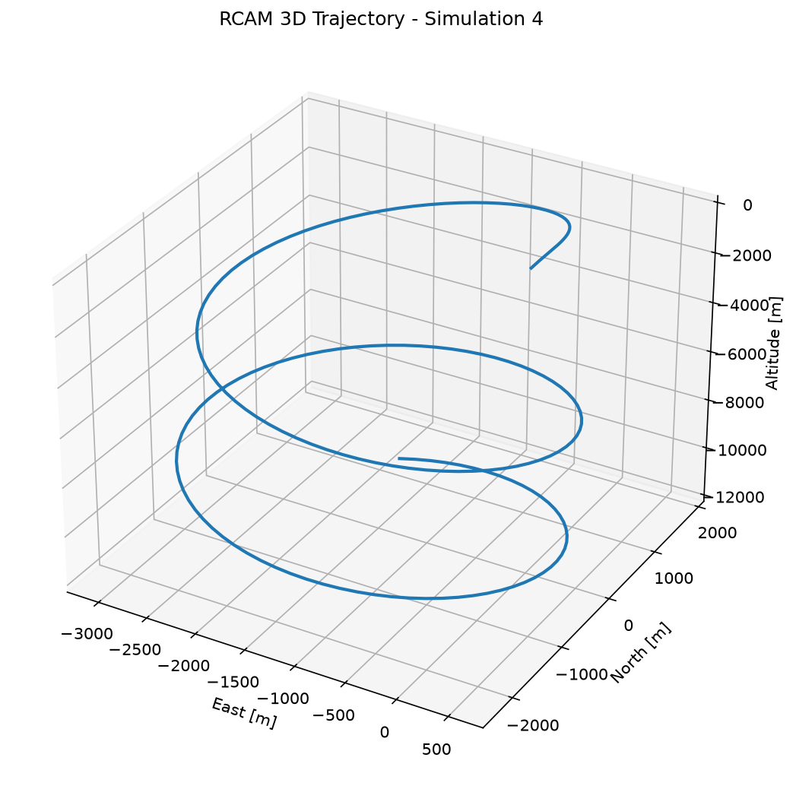
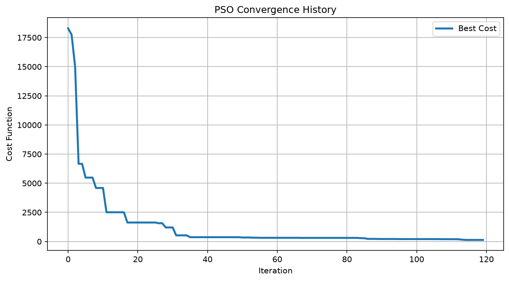
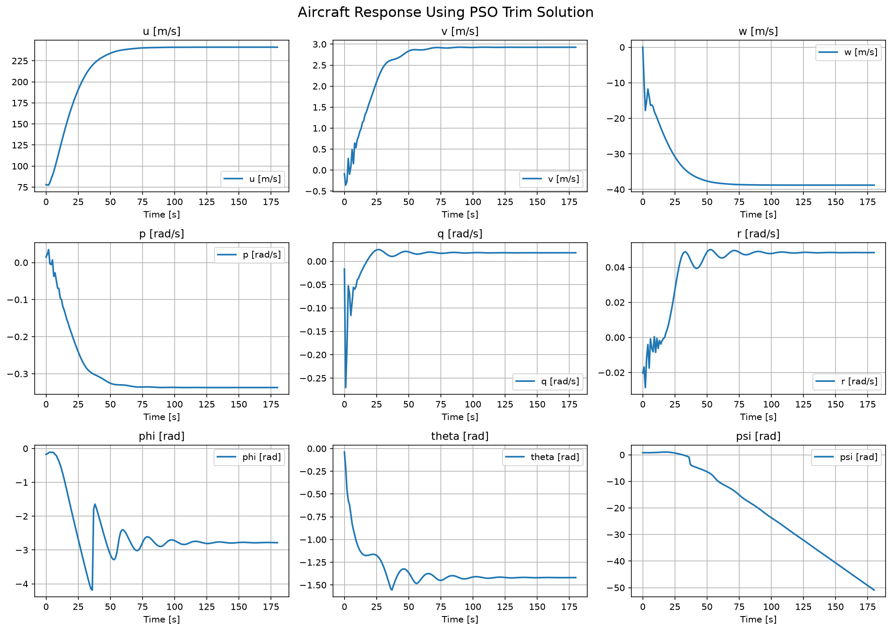
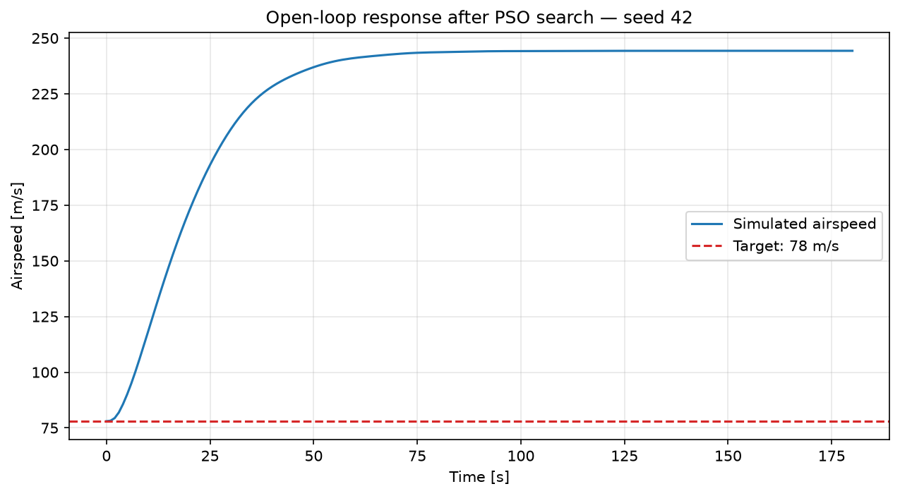

# RCAM — simulación de dinámica de vuelo

Implementación en Python de un modelo no lineal RCAM (Research Civil Aircraft Model), simulaciones con entradas de control y fallo de motor, y búsqueda de condiciones de equilibrio mediante Particle Swarm Optimization (PSO).

## Contenido

| Archivo | Función |
|---|---|
| `rcam_model.py` | Calcula las derivadas de nueve estados a partir de cinco entradas de control. |
| `simulate_p2_3_4A.py` | Simula vuelo con controles constantes, pulso de alerón o fallo de motor; genera gráficas y una animación GIF. |
| `simulate_p4B_pso.py` | Busca condiciones de trim con un motor apagado y muestra la respuesta del modelo con la solución obtenida. |

Estados: `X = [u, v, w, p, q, r, phi, theta, psi]`. Entradas: `U = [alerón, estabilizador, timón, empuje_1, empuje_2]`. Las velocidades se expresan en m/s; los ángulos, en radianes; y las velocidades angulares, en rad/s. Los estados se integran con RK4; la posición NED se integra por Euler en el script de simulación.

## Instalación

Con Python 3 y pip disponibles, desde la carpeta del proyecto:

```powershell
python -m venv .venv
.\.venv\Scripts\python.exe -m pip install -r requirements.txt
```

En Linux/macOS usa `.venv/bin/python` en lugar de `.\.venv\Scripts\python.exe`.

## Simulaciones

```powershell
.\.venv\Scripts\python.exe simulate_p2_3_4A.py
```

Edita `SIMULATION_TO_RUN` al principio del script:

- `2`: controles constantes.
- `3`: pulso de alerón de 5 grados entre los segundos 30 y 32.
- `4`: motor apagado desde el inicio. `FAILED_ENGINE` selecciona el motor 1 o 2.

`TF`, `DT_OUT` y `DT_INT` controlan la duración y los pasos temporales. La configuración inicial selecciona el escenario 4 y el fallo del motor 2. Las ventanas de Matplotlib aparecen en secuencia; ciérralas para continuar hasta la exportación del GIF.

## Optimización PSO

```powershell
.\.venv\Scripts\python.exe simulate_p4B_pso.py
```

El script busca una condición cercana a 78 m/s con un motor apagado, usando 45 partículas y 120 iteraciones. `FAILED_ENGINE` se configura de forma independiente en este archivo; su valor inicial es 1. Muestra el coste, los estados, los controles, las derivadas, la convergencia y la respuesta posterior.

La búsqueda del script interactivo es estocástica y no fija una semilla. Un coste pequeño no demuestra equilibrio exacto, estabilidad ni un mínimo global: deben evaluarse las derivadas y la trayectoria resultante. Las dependencias no están fijadas a versiones específicas.

## Gráficas de resultados

Las siguientes figuras se generan ejecutando el código de este repositorio durante 180 segundos simulados, con paso interno de 0,05 segundos. El escenario de fallo usa el motor 2 apagado; la búsqueda PSO usa el motor 1 apagado y semilla 42. La altura de las trayectorias es relativa al origen NED, no una altura inicial de vuelo especificada.

### Controles constantes




### Pulso de alerón




### Fallo del motor 2




### Búsqueda de trim con PSO





La curva de velocidad permite contrastar la solución encontrada con el objetivo de 78 m/s: en esta ejecución el coste final es aproximadamente 135,625, pero la velocidad llega a 244,296 m/s al terminar los 180 segundos. La convergencia del coste no equivale a mantener la velocidad objetivo ni demuestra un trim estable. Estas figuras muestran una ejecución del modelo, no una validación experimental.

En [results/](results/) están las 15 figuras, los datos CSV y el [manifiesto](results/manifest.json) con versiones, parámetros, huellas del código y resultados numéricos. Las huellas corresponden a los bytes de los archivos usados localmente; cambiar los finales de línea también cambia esas huellas. Para regenerarlos sin abrir ventanas:

```powershell
.\.venv\Scripts\python.exe generate_results.py --seed 42
```

## Alcance de la publicación

Se distribuyen los scripts, instrucciones y resultados de la ejecución documentada. El informe académico local queda excluido porque contiene datos personales. Las animaciones GIF se generan localmente y no se incluyen. Este proyecto es independiente de cualquier integración con APIs financieras.
